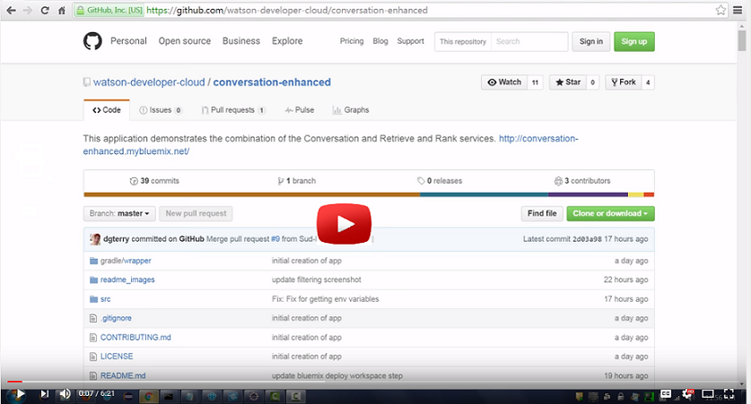
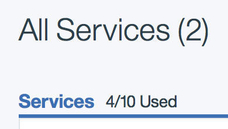
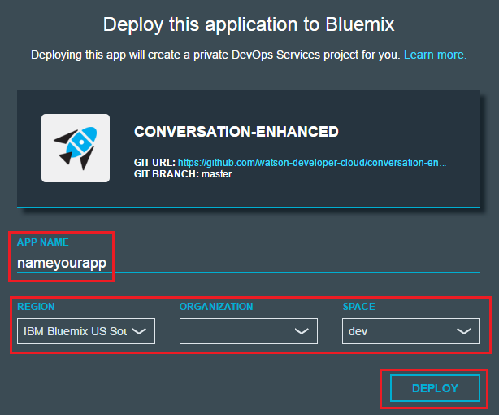
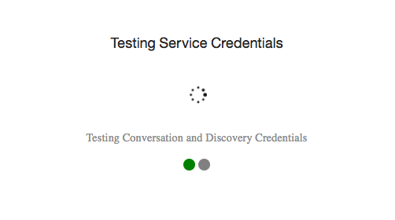
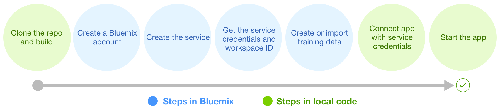
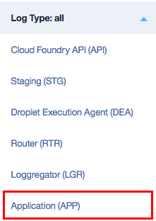

# Conversation Enhanced Sample Application

This application demonstrates the combination of the [Conversation](http://www.ibm.com/watson/developercloud/doc/conversation/index.shtml) and [Retrieve and Rank](http://www.ibm.com/watson/developercloud/doc/retrieve-rank/#overview) services. First, users pose questions to the Conversation service. If Conversation is not able to confidently answer, Conversation Enhanced executes a call to Retrieve and Rank to provide the user with a list of helpful answers.

<b>Either way you deploy this app, you must have a Bluemix account and run some steps within Bluemix.</b>

&nbsp;&nbsp;&nbsp;&nbsp;&nbsp;&nbsp;&nbsp;&nbsp;&nbsp;&nbsp;&nbsp;&nbsp;&nbsp;&nbsp;&nbsp;&nbsp;&nbsp;&nbsp;&nbsp;&nbsp;&nbsp;&nbsp;&nbsp;&nbsp;&nbsp;&nbsp;&nbsp;&nbsp;&nbsp;&nbsp;&nbsp;&nbsp;&nbsp;&nbsp;&nbsp;&nbsp;     &nbsp;&nbsp;&nbsp;&nbsp;&nbsp;&nbsp;&nbsp;&nbsp;&nbsp;&nbsp;&nbsp;&nbsp;&nbsp;&nbsp;&nbsp;&nbsp;&nbsp;&nbsp;&nbsp;&nbsp;&nbsp;&nbsp;&nbsp;&nbsp;&nbsp;&nbsp;&nbsp;&nbsp;&nbsp;&nbsp;&nbsp;&nbsp;&nbsp;&nbsp;

# How the app works
The application is designed and trained for chatting with a cognitive car.  The chat interface is on the left, and the JSON that the JavaScript code receives from the server is on the right. A user is able to ask two primary categories of questions.

Commands may be issued to the car to perform simple operations.  These commands are run against a small set of sample data trained with intents like "turn_on", "weather", and "capabilities".

Example commands that can be executed by the Conversation service are:

    turn on windshield wipers
    play music

This app has also ingested and trained itself based on a car manual. In addition to conversational commands, you can also ask questions that you would expect to have answered in your car manual. For example:

    How do I check my tire pressure
    How do I turn on cruise control

To watch a video about the code behind this app, see below.

<a name="bluemix">
# Getting Started using Bluemix
</a>

## Before you begin
1. Ensure that you have a [Bluemix account](https://console.ng.bluemix.net/registration/). 
2. Ensure that you have the necessary space available in your Bluemix account. This action deploys 1 application and 3 services.
  - You can view this on your Bluemix Dashboard. Tiles will show what space you have available.
  - For example, for Services & APIS 
  </img>

## Deploy the App
1. Select Deploy to Bluemix 
   
2. Log in with an existing Bluemix account or sign up. 
3. Name your app and select your REGION, ORGANIZATION, and SPACE. Then select DEPLOY. 
   
  This performs multiple actions:
    - Creates the app
    - Creates a Document Conversion service instance for use with the Retrieve & Rank tooling
    - Creates a Conversation service instance that the user needs for workspace creation
    - Creates a Retrieve & Rank service instance 

  The status of the deployment is shown. This can take some time.

  
4. Once your app has deployed, select VIEW YOUR APP. 
   
5. This lauches more actions, including:
  - Creating a SOLR cluster, config, and collection in the Retrieve & Rank service
  - Ingesting documents into the collection
  - Creating a trained ranker to aide in answering questions

  A dialog shows the progress.

  

  When setup is complete, you are informed that you need to add a WORKSPACE_ID. 
  <a name="returnbluemix">
6. Navigate to your Bluemix Dashboard and [import a workspace](#workspace). Setup your workspace then <b>return to these steps</b>.
</a> 
7. After you have set up a workspace, [add the WORKSPACE_ID environment variable](#env).

<a name="local">
# Getting Started locally
</a>

## Before you begin

-  Ensure that you have a [Bluemix account](https://console.ng.bluemix.net/registration/). While you can do part of this deployment locally, you must still use Bluemix.
-  Ensure that you have [Websphere Liberty Profile Server](https://developer.ibm.com/wasdev/downloads/liberty-profile-using-non-eclipse-environments/).

<a name="returnlocal">
## Setup Bluemix components
</a>

1. In Bluemix, [create a Conversation Service](http://www.ibm.com/watson/developercloud/doc/conversation/convo_getstart.shtml).
  * Create the [Service Credentials](#credentials).
  * [Import a workspace](#workspace).

2. In Bluemix, [create a Retrieve and Rank Service](http://www.ibm.com/watson/developercloud/doc/retrieve-rank/get_start.shtml). 
  * Create the [Service Credentials](#credentials).

## Building locally

To build the application:

1. Git clone the project `https://github.com/watson-developer-cloud/conversation-enhanced`

2. Navigate to the `conversation-enhanced` folder

3. For Windows, type `gradlew.bat build`. Otherwise, type `gradlew build`.
  - If you prefer, use your locally installed Gradle plugin instead of this provided wrapper.

4. The built WAR file (conversation-enhanced-0.1-SNAPSHOT.war) is in the `conversation-enhanced/build/libs/` folder.

## Running locally

1. Copy the WAR file generated above into the Liberty install directory's dropins folder. For example, `<liberty install directory>/usr/servers/<server profile>/dropins`. 
2. Navigate to the `conversation-enhanced/src/main/resources` folder. Copy the `server.env` file. 
3. Navigate to the `<liberty install directory>/usr/servers/<server name>/` folder (where < server name > is the name of the Liberty server you wish to use). Paste the `server.env` here. 
4. In the `server.env` file, search for **"retrieve_and_rank"**:
  - Replace the "name" field with the name you gave your Retrieve and Rank Service.  
  - Replace the "password" field.
  - Replace the "username" field. 
5. In the `server.env`, search for **"conversation"**.  
  - Replace the "name" field with the name you gave your Conversation Service.  
  - Replace the "password" field.
  - Replace the "username" field. 
6. Add the **WORKSPACE_ID** that you [copied earlier](#workspaceID). 
7. Start the server using Eclipse or CLI with the command `server run <server name>` (use the name you gave your server). 
8. Liberty notifies you when the server starts and includes the port information. 
9. Open your browser of choice and go to the URL displayed in Step 6. By default, this is `http://localhost:9080/`.

<a name="credentials">
# Service Credentials
</a>

1. Go to the Bluemix Dashboard and select the Conversation service instance. Once there, select the **Service Credentials** menu item.

  </img>

2. Select **New Credential**. Name your credentials then select **Add**.

3. Copy the credentials (or remember this location) for later use.

<a name="workspace">
# Import a workspace
</a>

To use the app you're creating, you need to add a worksapce to your Conversation service. A workspace is a container for all the artifacts that define the behavior of your service (ie: intents, entities and chat flows). For this sample app, a workspace is provided.

For more information on workspaces, see the full  [Conversation service  documentation](http://www.ibm.com/watson/developercloud/doc/conversation/).

1. Navigate to the Bluemix dashboard and select the **Conversation** service you created.

  

2. Click the **Launch Tool** button under the **Manage** tab. This opens a new tab in your browser, where you are prompted to login if you have not done so before. Use your Bluemix credentials.

  

3. Download the [exported JSON file](src/main/resources/workspace.json) that contains the Workspace contents.

4. Select the import icon: . Browse to (or drag and drop) the JSON file that you downloaded in Step 3. Choose to import **Everything(Intents, Entities, and Dialog)**. Then select **Import** to finish importing the workspace.

5. Refresh your browser. A new workspace tile is created within the tooling. Select the _menu_ button within the workspace tile, then select **View details**:

  

  <a name="workspaceID">
  In the Details UI, copy the 36 character UNID **ID** field. This is the **Workspace ID**.
  </a>

  

6. Return to the deploy steps that you were following:
  - For Local - [return to step 1](#returnlocal)
  - For Bluemix - [return to step 6](#returnbluemix)

<a name="env">
# Adding environment variables in Bluemix
</a>

1. In Bluemix, open the application from the Dashboard. Select **Runtime** and then **Environment Variables**.

  

2. In the **User Defined** section, add a variable with the name **WORKSPACE_ID**. For the value, paste in the Workspace ID you [copied earlier](#workspaceID). Select **SAVE**.

  

3. Restart your application.

# Troubleshooting in Bluemix

- Log in to Bluemix, you'll be taken to the dashboard.
- Navigate to the the application you previously created.
- Select **Logs**.

  

- If you want, filter the LOG TYPE by "APP".

  

# Troubleshooting with CLI

To see the logs, run the command

`$ cf logs < application-name > --recent`

# License

  This sample code is licensed under Apache 2.0.
  Full license text is available in [LICENSE](LICENSE).

# Contributing

  See [CONTRIBUTING](CONTRIBUTING.md).

## Open Source @ IBM

  Find more open source projects on the
  [IBM Github Page](http://ibm.github.io/).
