# Conversation with Discovery [](http://travis-ci.org/watson-developer-cloud/conversation-with-discovery)

This application demonstrates how you can combine the [Conversation](https://console.bluemix.net/docs/services/conversation/index.html#about) and [Discovery](http://www.ibm.com/watson/developercloud/doc/discovery/#overview) services to allow customers, employees or the public to get answers to a wide range of questions about a product, service or other topic using plain English. First, users pose a questions to the Conversation service. If Conversation is not able to confidently answer, the app executes a call to Discovery, which to provides a list of helpful answers.

## How the app works

The app has a conversational interface that can answer basic questions about a fictitious cognitive car, as well as more obscure questions whose answers can be found in the car’s manual. The app uses two Watson services: Conversation and Discovery. The Conversation service powers the basic Q&A using intents, relationships and natural language, and calls the Discovery app when it encounters questions it can’t answer. Discovery searches and ranks responses from the manual to answer those questions.

The application is designed and trained for chatting with your cognitive car. The chat interface is on the left, and the JSON that the JavaScript code receives from the server is on the right. A user is able to ask two primary categories of questions.

Commands may be issued to the car to perform simple operations.  These commands are run against a small set of sample data trained with intents like "turn_on", "weather", and "capabilities".

Example commands that can be executed by the Conversation service are:

    turn on windshield wipers
    play music

In addition to conversational commands, you can also ask questions that you would expect to have answered in your car manual. For example:

    How do I check my tire pressure
    How do I turn on cruise control
    How do I improve fuel efficiency
    How do I connect my phone to bluetooth

[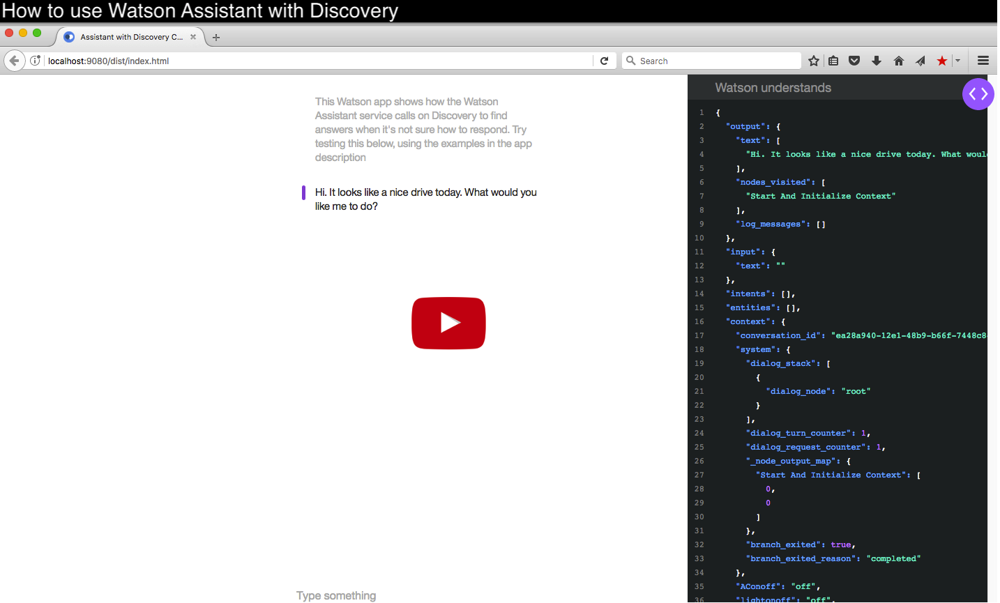](https://www.youtube.com/watch?v=SasXUqBE-38&index=8&list=PLZDyxLlNKRY_GJskIreh9sQgExJ4z8oZO)

<a name="local">
</a>


## Getting Started locally

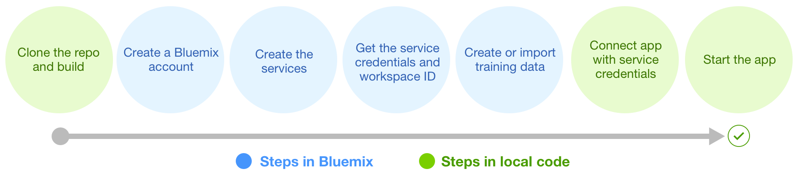</img>

### Before you begin

-  Ensure that you have a [Bluemix account](https://console.ng.bluemix.net/registration/). While you can do part of this deployment locally, you must still use Bluemix.
-  Ensure that you have [Websphere Liberty Profile Server](https://developer.ibm.com/wasdev/downloads/liberty-profile-using-non-eclipse-environments/).

<a name="returnlocal">
</a>

### Create the services

1. In Bluemix, [create a Conversation Service instance](https://console.ng.bluemix.net/registration/?target=/catalog/services/conversation/).
  * Create the [Service Credentials](#credentials).
  * [Import a workspace](#workspace).

2. In Bluemix, [create a Discovery Service instance](https://console.ng.bluemix.net/registration/?target=/catalog/services/discovery/).
  * Create the [Service Credentials](#credentials).
  * [Ingest the documents into a new Discovery collection](#ingestion).

### Building locally

To build the application:

1. Clone the repository  
   ```
   git clone https://github.com/watson-developer-cloud/conversation-with-discovery
   ```

2. Navigate to the `conversation-with-discovery` folder

3. For Windows, type `gradlew.bat build`. Otherwise, type `./gradlew build`.

4. The built WAR file (conversation-with-discovery-0.1-SNAPSHOT.war) is in the `conversation-with-discovery/build/libs/` folder.

### Running locally

1. Copy the WAR file generated above into the Liberty install directory's dropins folder. For example, `<liberty install directory>/usr/servers/<server profile>/dropins`.  
2. Navigate to the `conversation-with-discovery/src/main/resources` folder. Copy the `server.env` file.  
3. Navigate to the `<liberty install directory>/usr/servers/<server name>/` folder (where < server name > is the name of the Liberty server you wish to use). Paste the `server.env` here.  
4. In the `server.env` file, in the **"conversation"** section.  
  - Populate the "password" field.
  - Populate the "username" field.
  - Add the **WORKSPACE_ID** that you [copied earlier](#workspaceID).  
5. In the `server.env` file, in the **"discovery"** section.  
  - Populate the "password" field.
  - Populate the "username" field.
  - Add the **COLLECTION_ID** and **ENVIRONMENT_ID** that you [copied from the Discovery UI](#environmentID) 
  - (Optional) Edit the **DISCOVERY_QUERY_FIELDS** field if you set up a custom configuration . [Learn more here](custom_config/config_instructions.md).
6. Start the server using Eclipse or CLI with the command `server run <server name>` (use the name you gave your server). If you are using a Unix command line, first navigate to the `<liberty install directory>/bin/` folder and then `./server run <server name>`.
7. Liberty notifies you when the server starts and includes the port information.  
8. Open your browser of choice and go to the URL displayed in Step 6. By default, this is `http://localhost:9080/`.

---

<a name="ingestion">
</a>

### Create a collection and ingest documents in Discovery

1. Navigate to your Discovery instance in your Bluemix dashboard
2. Launch the Discovery tooling  
  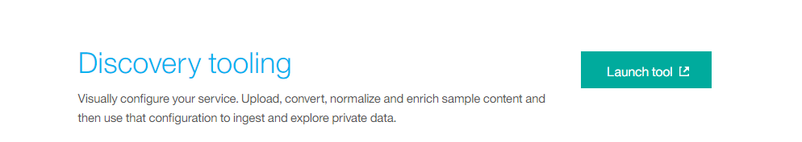

3. Create a new data collection, name it whatever you like, and select the default configuration.
  <div style="text-align:center;">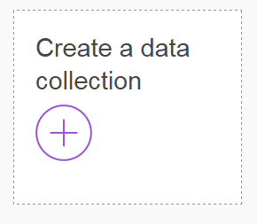</div><br>

  - After you're done, there should be a new private collection in the UI  
  <div style="text-align:center;">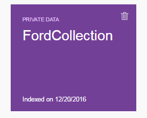</div>


4. (Optional) [Set up the custom configuration](custom_config/config_instructions.md) in order to enrich specific Discovery fields and improve results

5. On the collection tooling interface, click "Switch" on the Configuration line and select your new configuration

  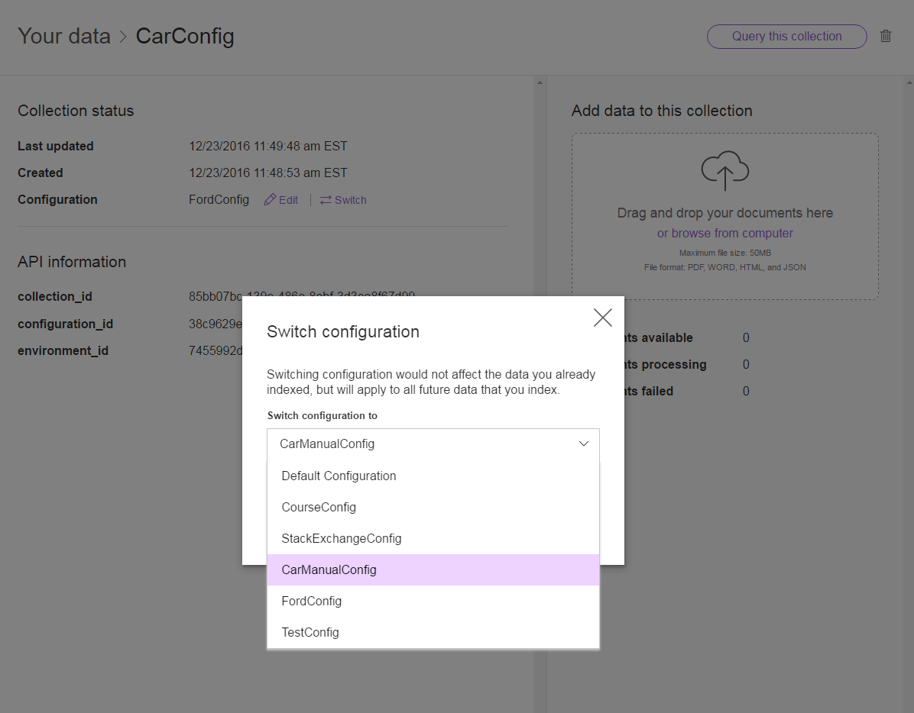</img>

6. Download and unzip the [manualdocs.zip](src/main/resources/manualdocs.zip) in this repo to reveal a set of JSON documents

7. In the tooling interface, drag and drop (or browse and select) all of the JSON files into the "Add data to this collection" box
  - This may take a few minutes -- you will see a notification when the process is finished

<a name="credentials">
</a>

### Service Credentials

1. Go to the Bluemix Dashboard and select the Conversation/Discovery service instance. Once there, select the **Service Credentials** menu item.

  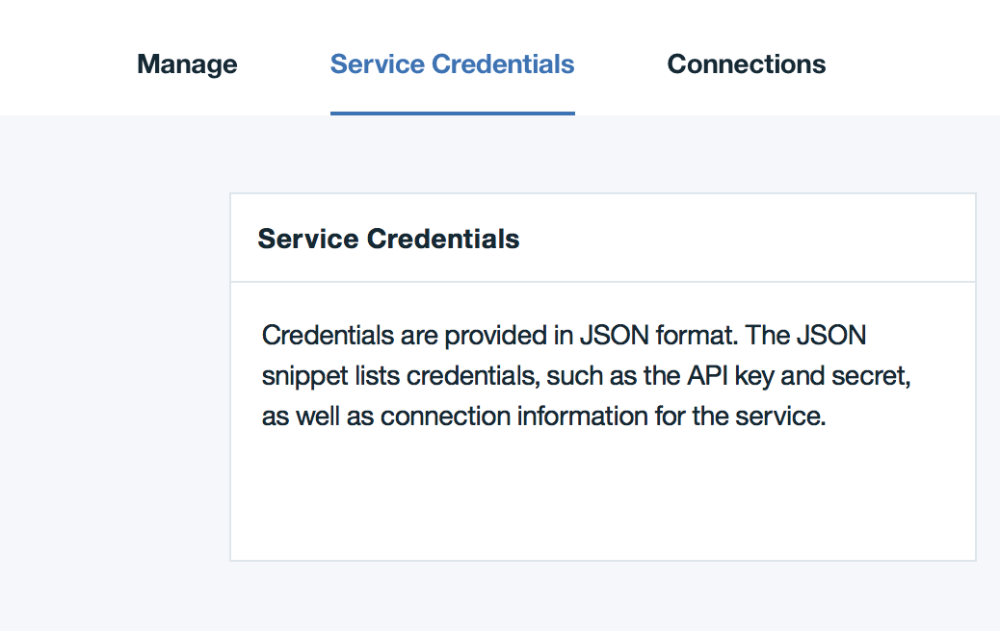</img>

2. Select **New Credential**. Name your credentials then select **Add**.

3. Copy the credentials (or remember this location) for later use.

<a name="workspace">
</a>

### Import a workspace

To use the app you're creating, you need to add a workspace to your Conversation service. A workspace is a container for all the artifacts that define the behavior of your service (ie: intents, entities and chat flows). For this sample app, a workspace is provided.

For more information on workspaces, see the full  [Conversation service documentation](https://console.bluemix.net/docs/services/conversation/configure-workspace.html#configuring-a-conversation-workspace).

1. Navigate to the Bluemix dashboard and select the **Conversation** service you created.

  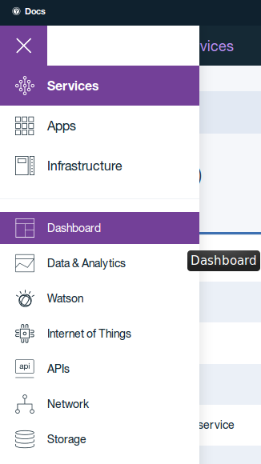

2. Click the **Launch Tool** button under the **Manage** tab. This opens a new tab in your browser, where you are prompted to login if you have not done so before. Use your Bluemix credentials.

  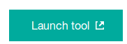

3. Download the [exported JSON file](src/main/resources/workspace.json) that contains the Workspace contents.

4. Select the import icon: . Browse to (or drag and drop) the JSON file that you downloaded in Step 3. Choose to import **Everything(Intents, Entities, and Dialog)**. Then select **Import** to finish importing the workspace.

5. Refresh your browser. A new workspace tile is created within the tooling. Select the _menu_ button within the workspace tile, then select **View details**:

  

  <a name="workspaceID">
  In the Details UI, copy the 36 character UNID **ID** field. This is the **Workspace ID**.
  </a>

  

6. Return to the deploy steps that you were following:
  - For Local - [return to step 1](#returnlocal)

<a name="env">
</a>

### Adding environment variables in Bluemix

1. In Bluemix, open the application from the Dashboard. Select **Runtime** and then **Environment Variables**.
  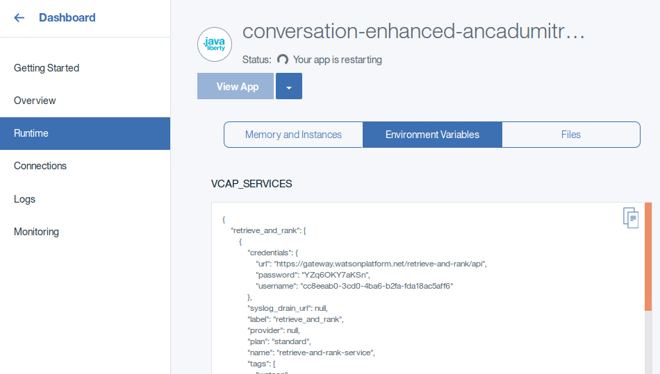
2. In the **User Defined** section, add the following Conversations environment variables:
  - **CONVERSATION_PASSWORD**: Use your Conversations [service credentials](#credentials)
  - **CONVERSATION_USERNAME**: Use your Conversations service credentials
  - **WORKSPACE_ID**: Add the Workspace ID you [copied earlier](#workspaceID).
3. Then add the following four Discovery environment variables to this section:
  - **DISCOVERY_PASSWORD**: Use your Discovery [service credentials](#credentials)
  - **DISCOVERY_USERNAME**: Use your Discovery service credentials
  - **DISCOVERY_COLLECTION_ID**: Find your collection ID in the Discovery collection you created
  - **DISCOVERY_ENVIRONMENT_ID**: Find your environment ID in the Discovery collection you created
  - **DISCOVERY_QUERY_FIELDS**: Set this value to 'none'. If you set up a custom configuration (optional), set this value to the name of your enrichment fields, separated by commas. [Learn more here.](custom_config/config_instructions.md).
  
4. Select **SAVE**.
5. Restart your application.

---

### Troubleshooting in Bluemix

1. Log in to Bluemix, you'll be taken to the dashboard.
1. Navigate to the the application you previously created.
1. Select **Logs**.  
  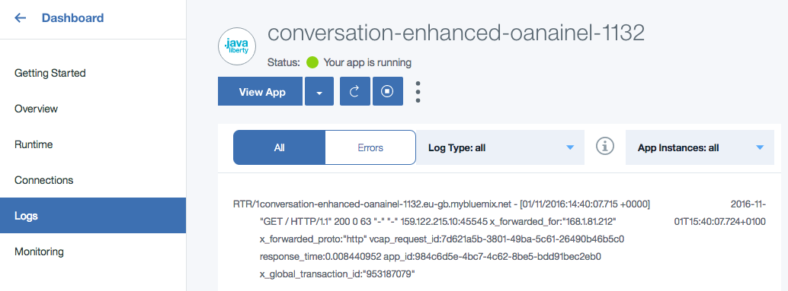

## License

  This sample code is licensed under Apache 2.0.
  Full license text is available in [LICENSE](LICENSE).

## Contributing

  See [CONTRIBUTING](CONTRIBUTING.md).

## Open Source @ IBM

  Find more open source projects on the
  [IBM Github Page](http://ibm.github.io/).


[cloud_foundry]: https://github.com/cloudfoundry/cli
[getting_started]: https://www.ibm.com/watson/developercloud/doc/common/
[conversation]: http://www.ibm.com/watson/developercloud/conversation.html
[discovery]: http://www.ibm.com/watson/developercloud/discovery.html

[docs]: http://www.ibm.com/watson/developercloud/conversation/
[sign_up]: https://console.ng.bluemix.net/registration/
