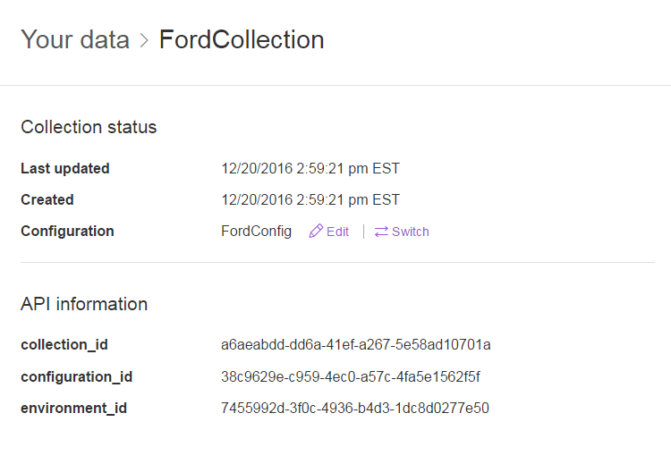
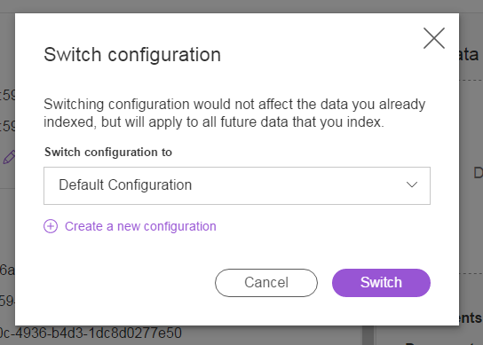
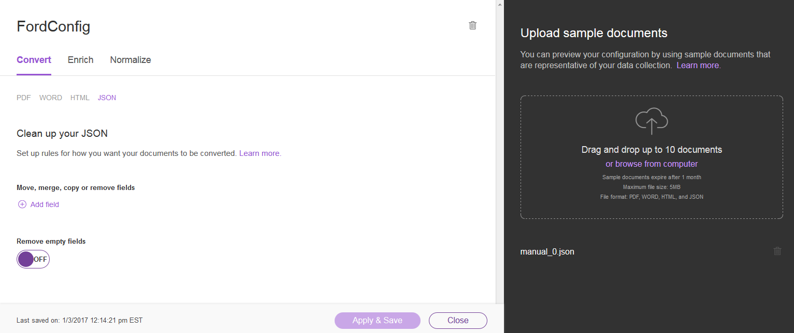
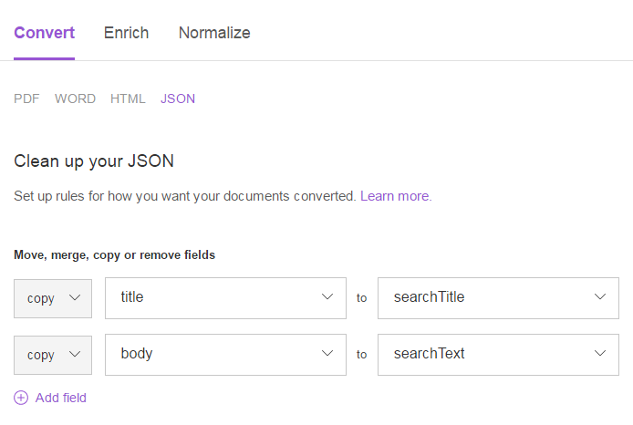
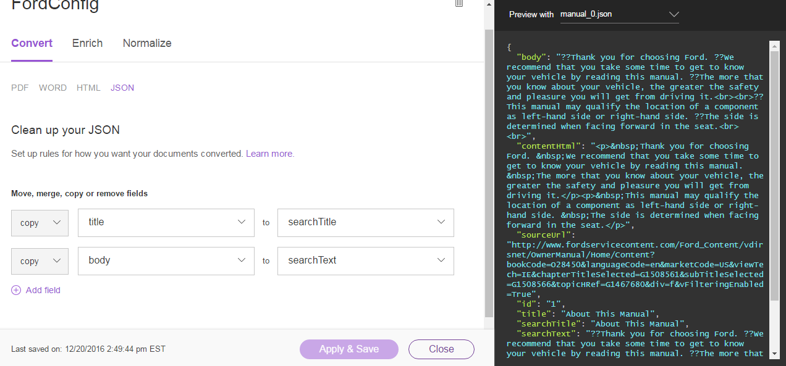
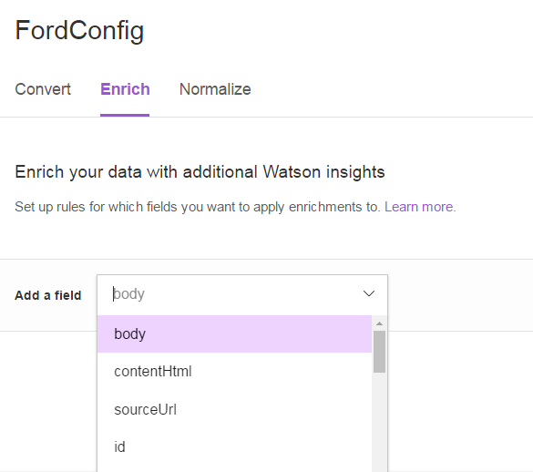
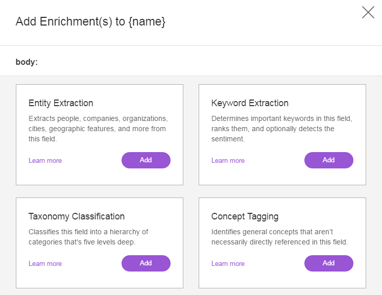
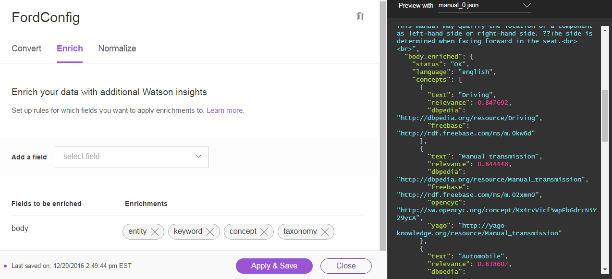
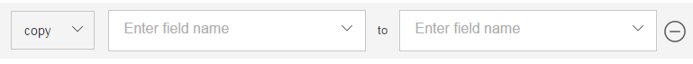
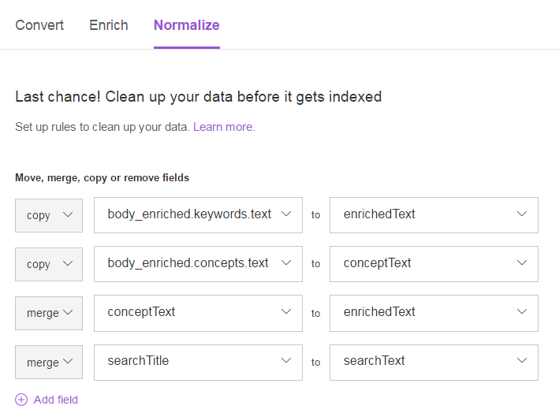

# Custom Configuration Setup

There are two ways you can update your Discovery configuration: upload a configuration file to the API using the command line, or update configuration settings in the Discovery UI.

After you are done setting up the custom configuration in Discovery, make sure you set the `DISCOVERY_QUERY_FIELDS` variable in your `server.env` file to the names of the Discovery fields that hold your enrichments, separated by commas. For example, if you are following the instructions exactly as below, use `DISCOVERY_QUERY_FIELDS=searchText,enrichedText` instead of the default `DISCOVERY_QUERY_FIELDS=none`.

<a name="configAPI">
</a>

## Set up a custom configuration with the Discovery API

1. Download the [FordConfig.json](FordConfig.json) in this repo

2. Open your computer's command line interface or terminal

3. Copy and paste the curl command below into your command line

4. Replace the placeholders in the curl command with your [credentials](#credentials), path to FordConfig.json, and [environment id](#environmentID)

5. Run the command

```sh
curl -X POST -u "<username>:<password>" \
-H "Content-Type: application/json" \
–data “@<path_to_config> \
"https://gateway.watsonplatform.net/discovery/api/v1/environments/<environment_id>/configurations?version=2016-12-01"
```

<a name="configUI">
</a>

## Set up a custom configuration with the Discovery Tooling

1. The configuration for this app includes several updates from the default that are meant to help improve the results for long-tail searches. To create this configuration in the tooling, go into the collection and where the DefaultConfiguration is listed, select “Switch”
  

2. Then choose "Create a new configuration"
  

3. This brings up the configuration editor. There are three steps in a configuration, Convert, Enrich, and Normalize. The configuration editor allows you to upload a sample document to preview the results of a configuration as you make changes.
  - To use the preview, add [manual_0.json](../src/main/resources/manual_0.json) into the pane on the right

  

4. For the Convert step, only JSON cleanup is needed for these documents. In this case what is needed is to create two new fields that are copies of the original body and title fields so that we can use the copies in a later step to create a searchable text field.
  
  - To create these   fields, select “Add field”, set the action to “copy” and enter title to searchTitle, and repeat for body to searchText
  - To see how the preview is affected by this step and ensure it is creating the new fields, click Apply & Save at the bottom of the page then select manual_0.json. The right side preview pane should update to display the results of the changes.

  

5. The next step in configuration is Enrich. Select “Enrich” from the top bar. In this we’ll set the configuration to enrich the body field of each document so we can use the enriched metadata to improve search.
  - First remove the existing “text” field that is being enriched with the default configuration by clicking the – to the right of the field.
  - Under “Add a field” enter “body” or select “body” from the dropdown

  

  - This will add a new field to be enriched below. You can then select the enrichments that should be applied to this field by clicking “Add enrichments”. In this case we can apply Keyword Extraction, Concept Extraction, Taxonomy Classification, and Entity Extraction. These enrichments add meta data to the documents that help improve search.

  

  - Once the enrichments have been selected, choose “Done” then again choose “Apply and Save” to see the results of the changes. Now there should be a body_enriched field in the preview that shows all the applied enrichments over the document

  

6. The final step in configuration is Normalize. This step allow you to clean up the data and fields so that you have a consistent structure for your use cases.
  - For these documents, we want to create searchable fields that can be use to improve the quality of results we get back for long tail questions
  - We will create two fields, one searchText that contains the combination of title and body, and one enrichedText field that contains the combination of extracted concepts and keywords from the body field.
  - To do this the concepts and keywords text first need to be copied into intermediate fields. To do this, click “Add field” and enter the fully qualified path to the keyword text (body_enriched.keywords.text) to enrichedText. Hint: Use the preview pane to find the paths to fields you need. Repeat this step for body_enirched.concepts.text to conceptText

  

  - Now we can merge the two intermediate fields together into the enrichedText field. Again select “Add a field”, choose the “merge” action and enter conceptText to enrichedText. This will merge the conceptText field into the enrichedText field, removing conceptText and preserving the combined enirchedText
  - Similarly we want to combine searchTitle and searchText, so click “Add a field” and merge searchTitle into searchText

  

  - Finally, again select apply&save to store the updated the configuration and see the preview results.
  - In the preview pane scroll to the bottom of the new document, and you should see a searchText field containing title + body and an enrichedText field containing a list of the concepts and keywords extracted from the data.
